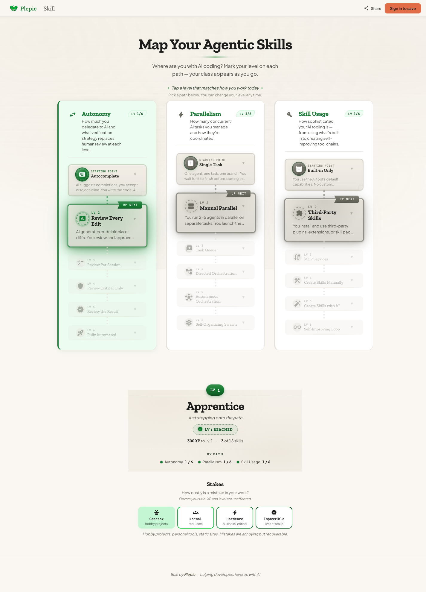

# Plepic Skill

_An RPG-style self-assessment for agentic coding skills._

🌐 **Live:** [skill.plepic.com](https://skill.plepic.com)

<!-- TODO: replace this static screenshot with an animated GIF showing the skill-claim interaction (level up + class change + celebration). -->



## What is this?

A self-assessment app for developers exploring **agentic coding** — claim the skills you've reached across three axes (**autonomy**, **parallelism**, **skill usage**), level up, unlock classes, and share your profile.

No account needed to play — your progress lives in your browser. Sign in to sync across devices and get a public, shareable profile at `skill.plepic.com/profile/<you>`.

## Features

- **Three skill paths**, six levels each — eighteen skills to claim
- **Levels and classes** that unlock as you progress
- **Stakes selector** that flavors your title without affecting XP
- **localStorage-first** — start playing instantly, sync later
- **Public, shareable profiles** at a stable URL once you sign in

## Built with agentic coding

This app was built using **some of the agentic coding methods we teach at [plepic.com/training](https://plepic.com/training)**. The repo itself is the evidence:

- **Design specs** in [`docs/superpowers/specs/`](docs/superpowers/specs/) — every chunk brainstormed, written up, and validated before code
- **Custom Claude Code skills** in [`.claude/skills/`](.claude/skills/) — brainstorming, validate-design, code-critique, and more
- **Per-PR preview environments** — every pull request spins up an isolated Cloud Run preview ([spec](docs/superpowers/specs/2026-04-16-preview-environments-design.md))
- **Multi-agent reviews** via ultrareview, plus full quality gates (typecheck, lint, unit + E2E + mutation tests) on every PR

## Tech stack

- **Frontend:** React + React Router v7 + Vite + TypeScript (SPA)
- **Backend:** Firebase Auth + Firestore
- **Infra:** Terraform (Firebase project, Firestore, GCS state) + Cloud Run for preview environments
- **Testing:** Vitest, Playwright + playwright-bdd, Stryker mutation testing
- **Hosting:** GitHub Pages

## Run it locally

```bash
pnpm install
pnpm dev          # local dev server (Vite)
pnpm test         # unit tests in watch mode
pnpm test:e2e:emulator   # E2E tests with auto-managed Firebase emulators
```

See [`CLAUDE.md`](CLAUDE.md) for the full set of commands, architecture decisions, and development practices.

## Contributing

Pull requests are welcome — we'd love more.

1. Open an issue first for non-trivial changes so we can align on direction
2. Fork, branch, and submit a PR — every PR gets its own preview environment so reviewers can click around your changes before they merge
3. Pre-commit and pre-push hooks run lint / typecheck / tests; CI does the rest

See [`CLAUDE.md`](CLAUDE.md) for development practices and architectural notes.

## License

[MIT](LICENSE) © Plepic
